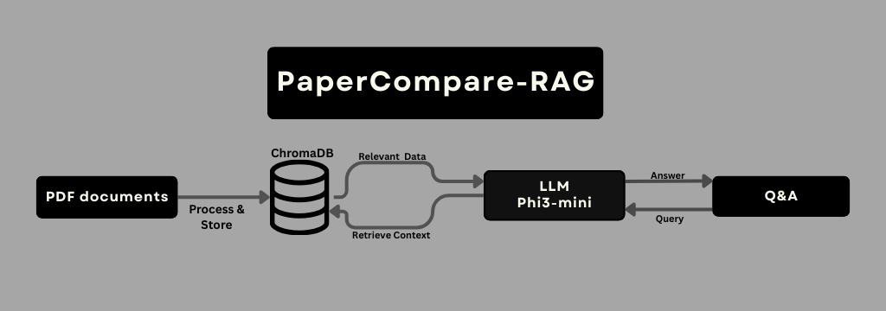

# PaperCompare-RAG
compares two AI paper PDFs and returns four bullets covering: batch size, steps/epochs, learning rate (and schedule), and warmup, other details.

---

# RAG Stack
- LLM: microsoft/Phi-3-mini-4k-instruct (Transformers)
- Embeddings: BAAI/bge-small-en-v1.5 (SentenceTransformers)
- Vector store / Retrieval: ChromaDB + section-aware chunking (650 chars) and axis-aware subqueries
- axis terms: batch size, epochs/steps/iterations, learning rate/schedule, warmup/dropout

---
# How to Use
- Upload two text-based PDFs (not scans).
- Important Tip: name them clearly, like ( BERT.pdf, RoBERTa.pdf).
- Click Index Papers (check chunk counts in Status).
- Write a question or choose from the examples and Ask.

---

# What papers to try? 
- NLP: BERT, RoBERTa 
- Vision (ImageNet):ViT , DeiT . Swin-T ,ConvNeXt-T . ResNet-50, EfficientNet-B0
- Open LLMs (7B class): LLaMA-2 , Mistral
- COCO detection : YOLOv3/YOLOv4
  
---

# Reset
- The local vector store  in ./paper_index. Delete this folder to clear all indexed text.

---

# limits
- Complex tables may be missed.

---

# future work
- to turn CompRAG into an agentic RAG that can answer any comparison question between 2 papers.
